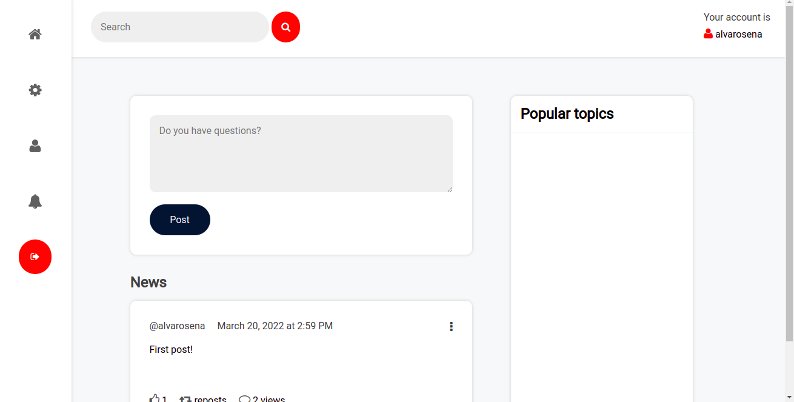
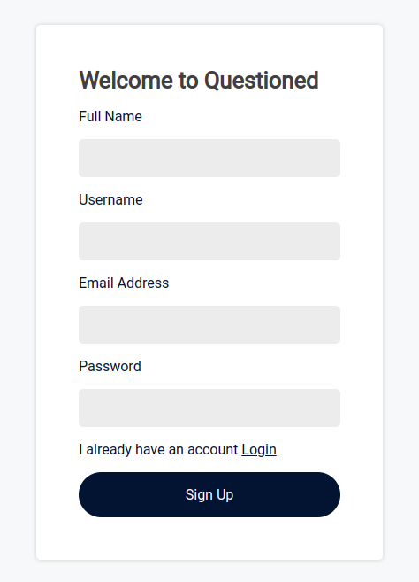

# Questioned Web App

Social Network inspired in Twitter.

 

 
 

## Setup & Installation

Make sure you have the lastest version of Python.

<pre>git clone 'repository' </pre>

## Activate environment and Running App

<pre>Linux/MacOS:  . ven/bin/activate</pre>
<pre>python3 app.py</pre>

## Technologies
- Python 
- Flask
- SQlite
- SQLAlchemy
- HTML
- CSS
- Javascript
